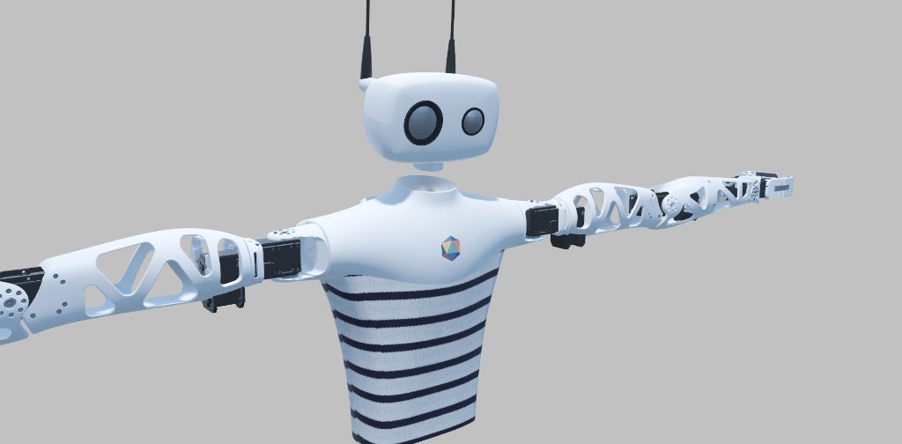

# Reachy's Blender models for creatives

Reachy is an actual open source robot made by the humans of [Pollen Robotics](https://www.pollen-robotics.com/).

Reachy is designed with a CAD tool but we decided to import his 3D models in blender to **offer the robot 3D asset to the community of creatives** made of artists, game designer, video makers or whoever wants to have fun with a virtual robot! 

Reachy model is **distributed under Creatives Commons Attribution-Share-alike 4.0 License**, so feel free to do whatever you want with those 3D models! Just please do not forget to give Pollen Robotics credit for the robot and share back if you improve the models :)

## GLTF conversion

Reachy model was converted to GLTF for the purpose of a digital twin.

You can move each joint in the exact same way as the real robot. Motors are simulated with empties rotating around Z axis, all joint are named like `blala_joint` so you can easily find them in the tree.

For any question on Reachy please join [Pollen Robotics forum](https://forum.pollen-robotics.com/)!
